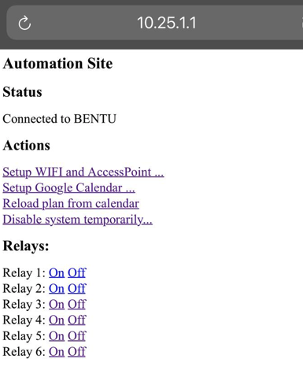

# Relay-Scheduler

This project was done as a hobby, with the challenge to build a sprinklers automation system for my garden, with the aim to make it dirt cheap and open source.
Hopefully other can enjoy it as well.

The Relay Scheduler is a small device which can control a set of relays and activate them based on a schedule, maintained in a Google Calender.
I used it for water sprinklers but of course it can be used to any electrical powered devices.

## Hardware Prerequisite
- 1 - Arduino compliant device with Wifi - I used `WeMos D1 mini` (2-4$  in e.g. Aliexpress) 
- 1 - 6 channel relay module, 5v - approx. 6$
- 8 wires - approx. 1$
- Power adapter (5v)

## Technical Knowledge/prerequisite 
- You need to be able to flush the program in this repo into the arduino device
- Have a Gmail account - for calendar and Drive/Apps Script access
- You need to be able to wire the arduino device with the relay
- Any connection of high voltage power device is at your own. I suggest hiring a certified electrician for such cases, or stick to low voltage devices (e.g. 24v electric water valve for watering system)

## Setup steps
1. flush the software to the arduino device
2. setup a new, dedicated google calendar in your existing Gmail account
3. deploy the google Apps Script (details below...)
4. wire the device to the relay and your electrical device to the relay channels (details below...)
5. Configure the device via a web interface (details below...)
6. Add meeting in the Google Calendar (details below...)
6. you are good to go!

### 1. flush the software to the arduino device
This project is setup to use PlatformIO. I found it very useful to work with WeMos, I used VSCode's plugin of PlatformIO (PlatformIO IDE). Follow the plugin details page to see how to flush the code into the device.

### 3. deploy the google Apps Script
- Goto `https://script.google.com/`
- Create new project
- Copy and paste the code in `src/code.gs` into your project's `code.gs` file
- Press 'Deploy'-> 'New Deployment'
- Select type: webapp, execute as: Me (you Gmail address), Who has access: Anyone. - press 'Deploy'
 

 
- Authorize -> choose you Gmail account -> click 'advanced' -> click `go to <your project name>` -> Press 'Allow'
 

 
- Copy the URL of the webapp - it has the following format: `https://script.google.com/macros/s/<function-name>/exec`
- Test it by adding `?cal=<calendar name>` - the calendar you created in step 2.
- Save the function name for later use in step 5

### 4. wire the device
- relay channels wires: D1 to channel 1 (IN1), D2 to channel 2 (IN2), ...
  - you may set as many relays as you want, simply change the `#define MAX_RELAYS  6` to any number you choose.
- `5v` to the relay's `DC+`
- `G` to relay's `DC-`

### 5. Configure the device via a web interface 
As soon as the device is on, in creates a WIFI Access Point, which by default is called AUTOMATION_AP with no password.
- Connect to the AUTOMATION_AP WIFI and navigate to 10.25.1.1
 

 
- select 'Setup WIFI and Access Point...'
   
  
   
  - The first two fields are for your home wifi, used by the  device to make calls to your google Apps Script and fetch the schedule from your calendar and also log events.
  - The last two fields are for the device access-point - you can rename and choose password (don't forget it, otherwise you'd need to wipe it and start over to reset [see Wipe your device](#Wipe your Device))
  - After submitting, you may need to reconnect if the device access point has changed.
- Now, in the main page select 'Setup Google Calendar...'
   
  
   
  - enter the calendar name, as chosen in step 2
  - enter the function name saved from step 3
  - Submit
- Once all of this is done, you device is ready! 

### 6. Add meeting in the Google Calendar
Now all you have left to do is to schedule in the Google calendar some meetings to reflect turning ON a relay.

- The meeting title should be the relay number (`1` for the first etc.). You may also put more than one relay, comma separated. Example: `1,3`.
- The length of the meeting would be how long the relay stays ON.
- Meeting can be recurring
- Make sure you save the new meeting to the designated calendar you created in step 2. 
- The device reads the calendar every 24 hours (to change it, change this constant: `#define MILLIS_BETWEEN_SERVER_POLL 86400000 //24 hours`)
- If you wish to make it effective immediately, you can navigate to the main-page and select `Reload plan from calender`
- The device does not have own clock, so time is taken from google and updated on every calendar reloads. in between there may be small drifts (seconds) per day...

## My final result

## Wipe your Device
To reset all data, you'd need to change `#define CURRENT_VERSION 1239` to other number and re-flush the code into the device. this will cause the device to drop the persistent memory and in fact reset.